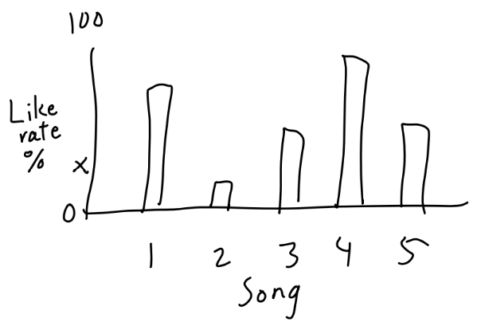

### Evaluation of the recommendations

Since music taste is a personal opinion that can't be measured directly as a quantitative value the evaluation was done using datasets containing information about what songs users had pressed "like" on on platforms separate from the Million Songs dataset. The primary plan was to use data from Thisismyjam, which used to be a social music website which allowed users to post their current favorite song, or "jam". The process can be described with the following steps:

1. Pick the users that have liked the song the user of the music recommender selected
2. Check if the users have also liked the songs that the recommender recommended
3. For each recommended song, display #users that liked the user selected and recommended song / #users that liked the user selected song

```
               users that liked the user selected and recommended song
evalutation = ----------------------------------------------------------
                        users that liked the user selected song
```

The song IDs from the MSD dataset had already been paired with those from Thisismyjam using fuzzy string matching with the Python search engine library Whoosh. Unfortunately, it was noticed that the amount of matching songs in our project's subset of songs was not large enough to perform a good evaluation, so new data had to be found. The second plan was to perform a similar process with data from the Echo taste profile dataset, which contained similar data for 1 million users. However, it was noticed that each user seemed to only have a few songs on their list (1.69 on average), which was insufficient for our needs. An empirical analysis where different combinations of attributes that were considered in the recommendation part was performed to see if a better subset of attributes that would yield a subset of users that would have a larger number of songs in their lists could be found, but did not produce any better results. A working version of the evaluation code was still completed and has been left in the program for documentation purposes.

### What did not work

Since the verification data from Thisismyjam and Echo did not suit the project's needs, the evaluation part of the app was never visualized. The code that performs this part is still left in the code under "Comparison" in the method `echoComparison()`. Below is a sketch of what the visualization would have looked like. The idea was to have histograms with the recommended songs on the X axis and the like rate on the Y axis. See Evaluation of the recommendations for more info about the evaluation.

